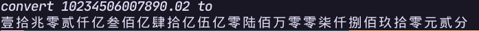

# for-beginners

some practical, mini and easy projects to help beginner used to writing code!

## framed-text (Python, Rust)

add frame to text. make text more attractive!

## print-tables (Python, Rust)

make an tables in terminal!
like the [tables in rich](https://github.com/Textualize/rich), but more simple and easy to read and write your own code!

## tree-printer (Python)

print the tree structure in visual way!
only few line, recursive, simple, and easy to understand!

## blind-watermark (Python)

hide the information in a invisible way!

## convert money (Python)

convert the number to Chinese money!

## termgraph (Python)

a hack version of [termgraph](https://github.com/sgeisler/termgraph.git)
but simplified!

