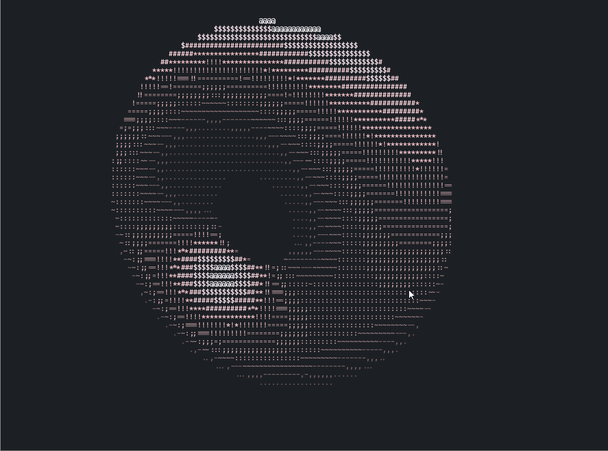

# for-beginners

[中文](./README_cn.md)

some practical, mini and easy projects to help beginner used to writing code!  
all the projects is for study and practice not for product!

## neodonut (Rust)

a donut re-impl and enhanced version (support multi-threads).  
a sample:


## calculator (Rust)

a simple but powerful calculator  
pls see this example

```
>>> 12.34 * 45.67 + 6! / 2^4
608.5678
>>> fun f(a b) = a^x + sin(b) * floor(a*b+5)
>>> x = 4
>>> f(ln(PI) E)
5.003415549553682
>>>
```

**note: it is in dev, some thing will change**

## termgraph (Python, Rust)

a hack version of [termgraph](https://github.com/sgeisler/termgraph.git)
but simplified!


## framed-text (Python, Rust)

add frame to text. make text more attractive!


## print-tables (Python, Rust)

make an tables in terminal!
like the [tables in rich](https://github.com/Textualize/rich), but more simple and easy to read and write your own code!


## tree-printer (Python)

print the tree structure in visual way!
only few line, recursive, simple, and easy to understand!


## blind-watermark (Python)

hide the information in a invisible way!


## spark (Python, Rust)

a hack version of [spark](https://github.com/holman/spark)!
there is nothing hard in this hack version!


