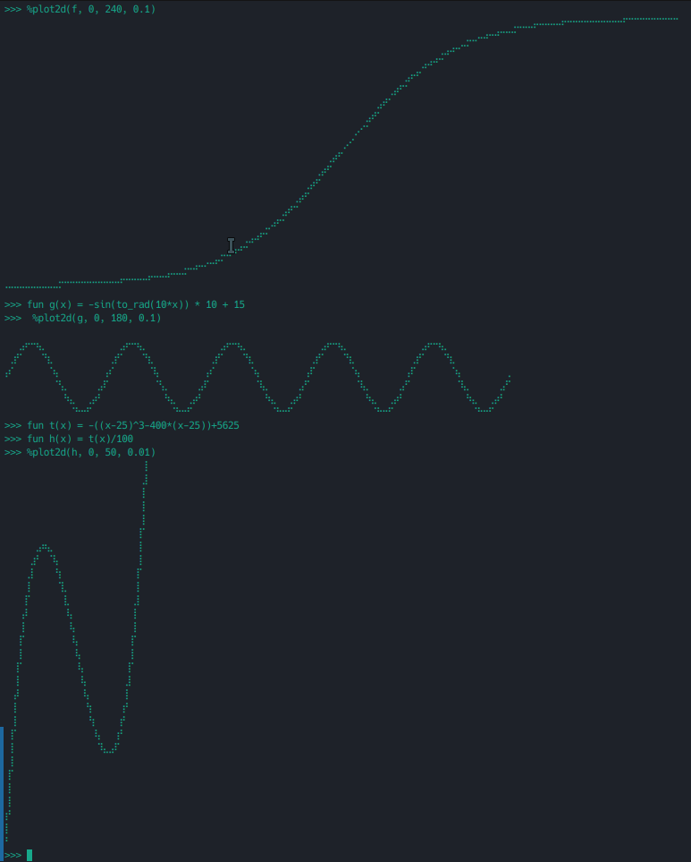

# for-beginners

[中文](./README_cn.md)

some practical, mini and easy projects to help beginner used to writing code!
all the projects is for study and practice not for product!
every project is small(less than 1000 loc) and easy to understand.

## [drawille](./drawille/README.md) (Rust)

a copy version of [drawille](https://github.com/asciimoo/drawille).


## [neodonut](./donut/README.md) (Rust)

a donut re-impl and enhanced version (support multi-threads).  
a sample:


## [calculator](./calculator/README.md) (Rust)

a simple but powerful calculator  
pls see this example
```
>>> 12.34 * 45.67 + 6! / 2^4
608.5678
>>> fun f(a b) = a^x + sin(b) * floor(a*b+5)
>>> x = 4
>>> f(ln(PI) E)
5.003415549553682
>>>
```
and it support a magic function plot:


**note: it is in dev, some thing will change**

## [termgraph](./termgraph/README.md) (Python, Rust)

a hack version of [termgraph](https://github.com/sgeisler/termgraph.git)
but simplified!


## [framed-text](./framed-text/README.md) (Python, Rust)

add frame to text. make text more attractive!


## [print-tables](./print_tables/README.md) (Python, Rust)

make an tables in terminal!
like the [tables in rich](https://github.com/Textualize/rich), but more simple and easy to read and write your own code!


## [tree-printer](./tree-printer/README.md) (Python)

print the tree structure in visual way!
only few line, recursive, simple, and easy to understand!


## [blind-watermark](./blind_watermark/README.md) (Python)

hide the information in a invisible way!


## [spark](./spark/README.md) (Python, Rust)

a hack version of [spark](https://github.com/holman/spark)!
there is nothing hard in this hack version!


