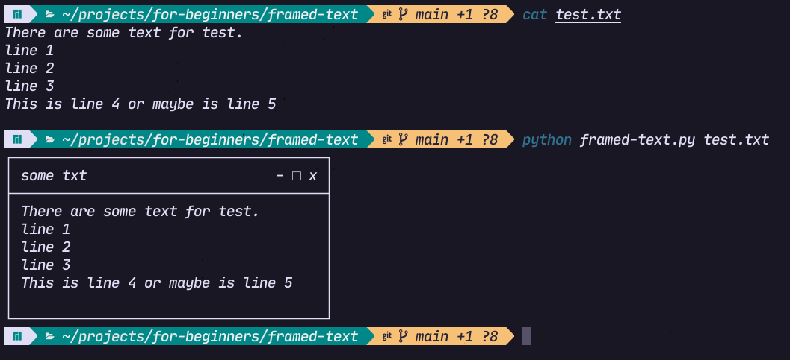
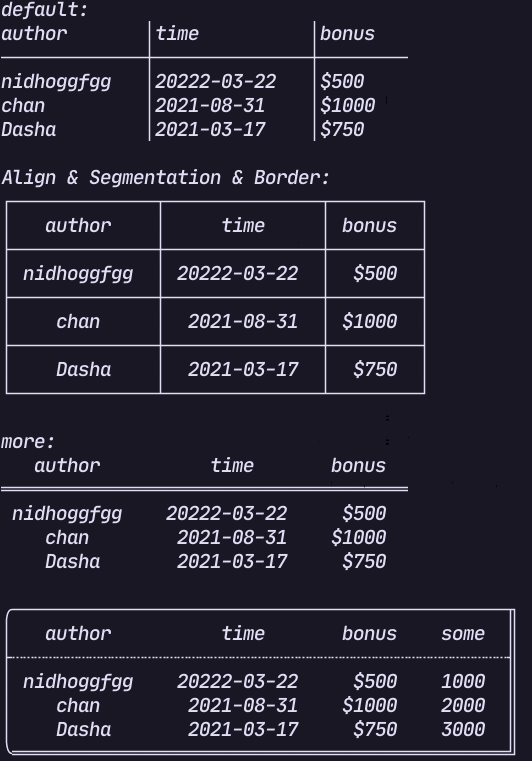
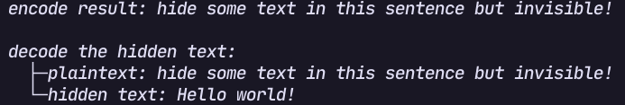

# 适合初学者练手的项目

一些小的，简单的，适合初学者练手的项目来帮助初学者学习编程！
所有本仓库内的项目都是非常简单的(复杂的部分会简化掉)，同时还有很多很好玩的小玩意！

## 终端中看股票 (Python, Rust)

一个 [termgraph](https://github.com/sgeisler/termgraph.git) 的复刻版，但是简化过了(简化了代码，没有简化功能)。
python 的版本只包含 2 个主要的函数，还很简短也不复杂！


## 文本加框 (Python, Rust)

将文本加上一个窗口，使得更加~~装逼~~引人注目



## 字符表格 (Python, Rust)

将数据展示为表格的形式并且不需要图形化界面，更好的~~装逼~~展示数据
可以看作是 [rich](https://github.com/Textualize/rich) 中 table 模块的一个简化，但两者并不相同



## 打印树型结构 (Python, Rust)

将树型的结构(目录等)打印为易懂的形式，更好的~~装逼~~查看树型结构
实现所用的算法并不复杂，只有简短的几行，递归实现


## 盲水印 (Python)

将“看不见”的信息放入到任何内容内(图片，文字...)！



## 金钱格式转化 (Python, Rust)

将数字转化为正规的金额表示方式

```
$ ./convert.py 89129487932
捌佰玖拾壹亿贰仟玖佰肆拾捌万柒仟玖佰叁拾贰圆整
$ ./convert.py 7892749003240.90
柒万亿捌仟玖佰贰拾柒亿肆仟玖佰万零叁仟贰佰肆拾圆玖角
```
