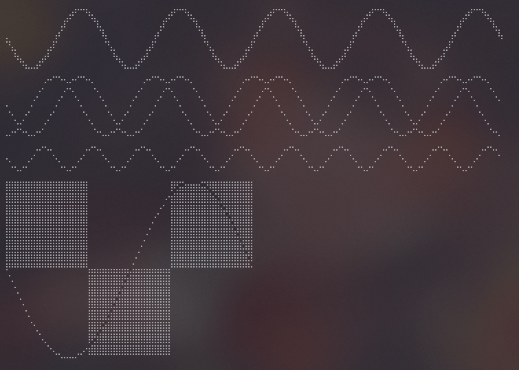
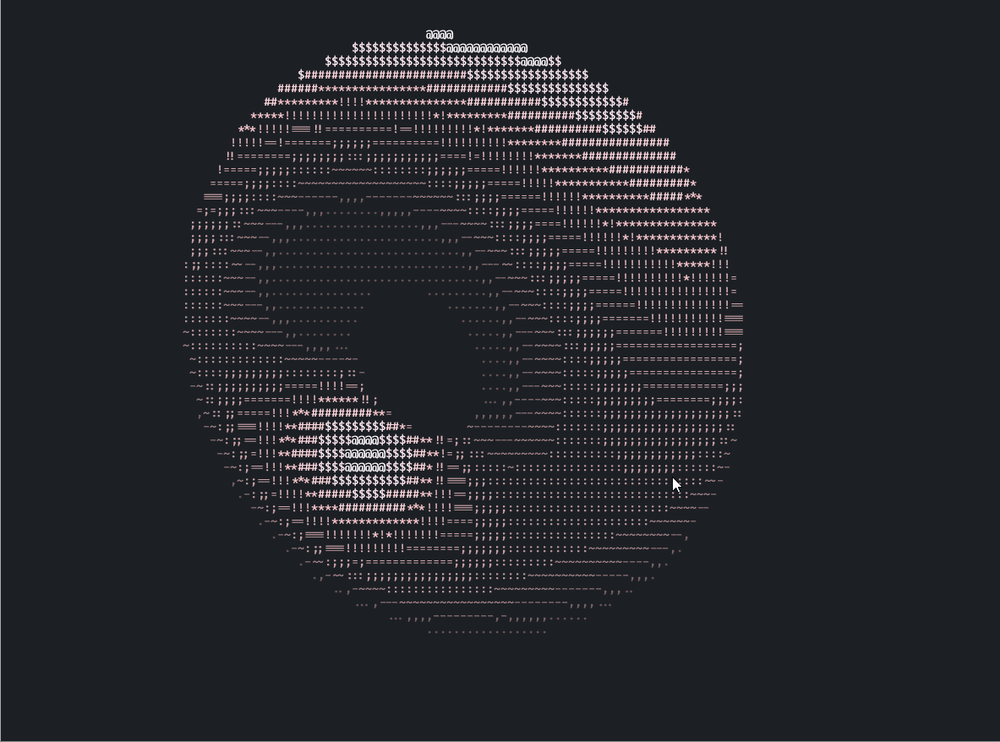
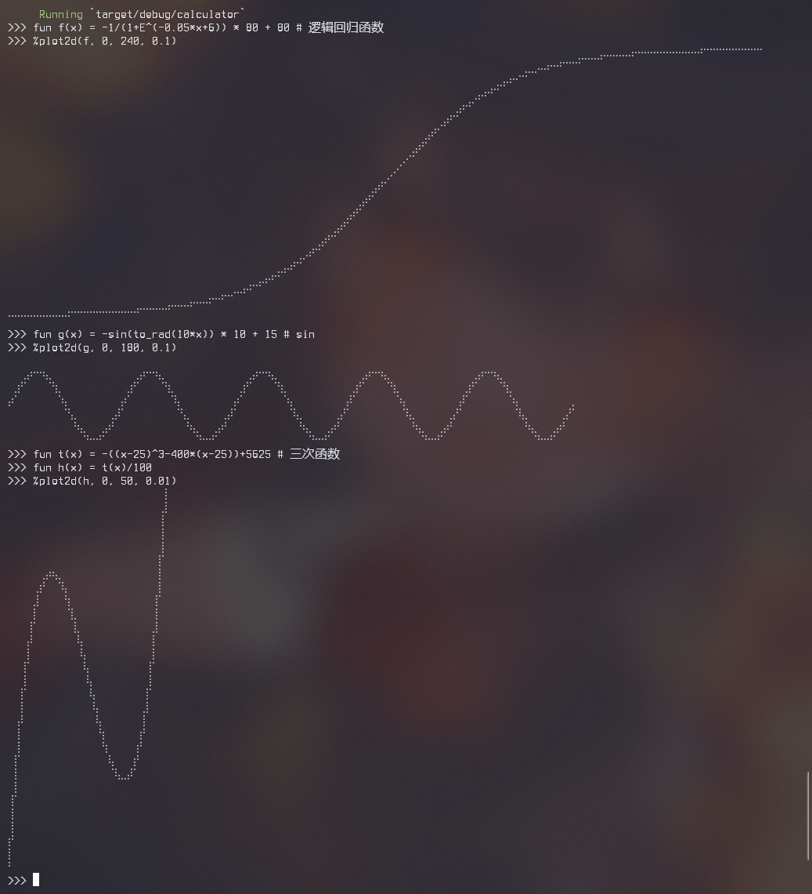

一些小的很有意思的代码，所有的代码都尽可能简单
每个小项目都几乎不需要背景知识，只需要稍微了解编程语言即可

**因为简化代码，这些代码几乎都不能用于生产环境！**

## [drawille](./drawille/README_cn.md) (Rust)

一个 [drawille](https://github.com/asciimoo/drawille) 的复刻版，有些许增强。




## [甜甜圈](./donut/README_cn.md) (Rust)

这是一个甜甜圈的复刻版本，以及一个增强版本 (支持多线程)。


## [计算器](./calculator/README_cn.md) (Rust)

支持函数，变量，绘图的计算器，总共只有 1000 行代码！
```
>>> 12.34 * 45.67 + 6! / 2^4 - 1.2+3*(1-2)
604.3678
>>> fun f(a b) = a^x + sin(b) * floor(a*b+5)
>>> x = 4
>>> f(ln(PI) E)
5.003415549553682
>>> fun g(x) = -sin(to_rad(10*x)) * 10 + 15
>>> %plot2d(g, 0, 72, 0.1)
⠀⠀⠀⠀⠀⠀⠀⠀⠀⠀⠀⠀⠀⠀⠀⠀⠀⠀⠀⠀⠀⠀⠀⠀⠀⠀⠀⠀⠀⠀⠀⠀⠀⠀⠀⠀⠀
⠀⠀⢀⡴⠒⠲⣄⠀⠀⠀⠀⠀⠀⠀⠀⠀⠀⠀⠀⠀⢀⡴⠒⠲⣄⠀⠀⠀⠀⠀⠀⠀⠀⠀⠀⠀⠀
⠀⣰⠋⠀⠀⠀⠈⢳⡀⠀⠀⠀⠀⠀⠀⠀⠀⠀⠀⣰⠋⠀⠀⠀⠈⢳⡀⠀⠀⠀⠀⠀⠀⠀⠀⠀⠀
⡴⠁⠀⠀⠀⠀⠀⠀⠱⡄⠀⠀⠀⠀⠀⠀⠀⠀⡴⠁⠀⠀⠀⠀⠀⠀⠹⡄⠀⠀⠀⠀⠀⠀⠀⠀⡀
⠀⠀⠀⠀⠀⠀⠀⠀⠀⠙⣄⠀⠀⠀⠀⠀⢀⡼⠁⠀⠀⠀⠀⠀⠀⠀⠀⠙⣄⠀⠀⠀⠀⠀⢀⡼⠁
⠀⠀⠀⠀⠀⠀⠀⠀⠀⠀⠘⢦⡀⠀⠀⣠⠞⠀⠀⠀⠀⠀⠀⠀⠀⠀⠀⠀⠘⢦⡀⠀⠀⣠⠞⠀⠀
⠀⠀⠀⠀⠀⠀⠀⠀⠀⠀⠀⠀⠙⠒⠚⠁⠀⠀⠀⠀⠀⠀⠀⠀⠀⠀⠀⠀⠀⠀⠙⠒⠚⠁⠀
```


## [终端中看股票](./termgraph/README.md) (Python, Rust)

一个 [termgraph](https://github.com/sgeisler/termgraph.git) 的复刻版，但是简化过了(简化了代码，没有简化功能)。
python 的版本只包含 2 个主要的函数，还很简短也不复杂！


## [文本加框](./framed-text/README.md) (Python, Rust)

将文本加上一个窗口，使得更加~~装逼~~引人注目


## [字符表格](./print-tables/README.md) (Python, Rust)

将数据展示为表格的形式并且不需要图形化界面，更好的~~装逼~~展示数据
可以看作是 [rich](https://github.com/Textualize/rich) 中 table 模块的一个简化，但两者并不相同


## [打印树型结构](./tree-printer/README.md) (Python, Rust)

将树型的结构(目录等)打印为易懂的形式，更好的~~装逼~~查看树型结构
实现所用的算法并不复杂，只有简短的几行，递归实现


## [盲水印](./blind-watermark/README_cn.md) (Python)

将“看不见”的信息放入到任何内容内(图片，文字...)！


## [金钱格式转化](./convert-money/README_cn.md) (Python, Rust)

将数字转化为正规的金额表示方式

```
$ ./convert.py 89129487932
捌佰玖拾壹亿贰仟玖佰肆拾捌万柒仟玖佰叁拾贰圆整
$ ./convert.py 7892749003240.90
柒万亿捌仟玖佰贰拾柒亿肆仟玖佰万零叁仟贰佰肆拾圆玖角
```

## [spark](./spark/README.md) (Rust, Python)

一个 [spark](https://github.com/holman/spark) 的复刻版本。


