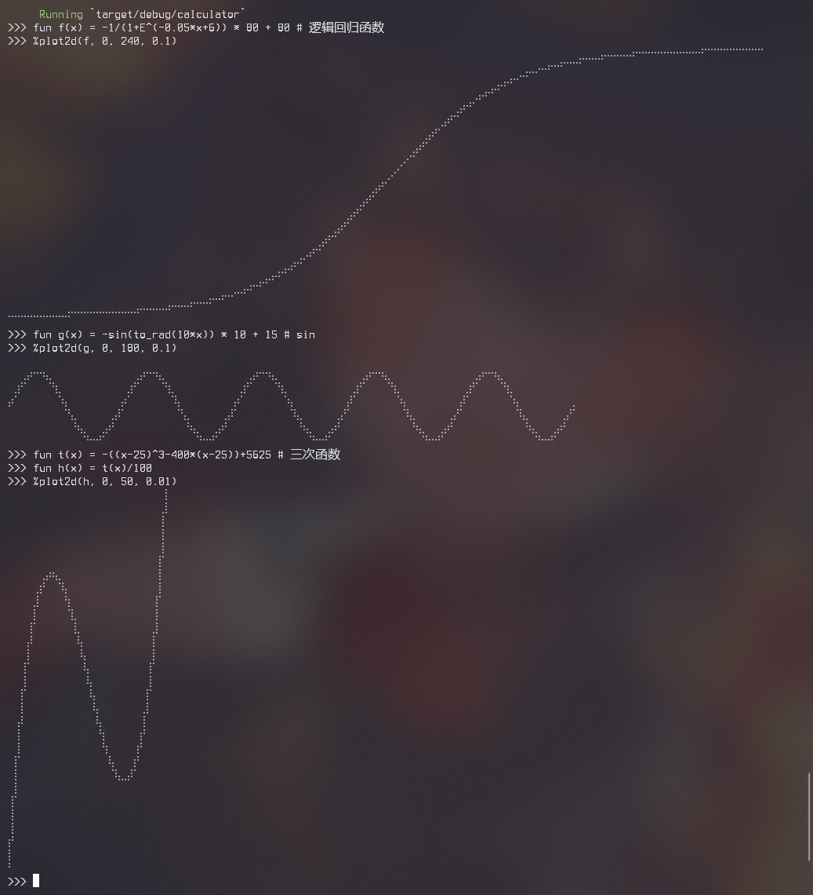

# calculator

[中文](./README_cn.md)

A simple calculator, but interesting, with about 1000 sloc (including the drawing part).

```
>>> 12.34 * 45.67 + 6! / 2^4 - 1.2+3*(1-2)
604.3678
>>> fun f(a b) = a^x + sin(b) * floor(a*b+5)
>>> x = 4
>>> f(ln(PI) E)
5.003415549553682
>>> fun g(x) = -sin(to_rad(10*x)) * 10 + 15
>>> %plot2d(g, 0, 72, 0.1)
⠀⠀⠀⠀⠀⠀⠀⠀⠀⠀⠀⠀⠀⠀⠀⠀⠀⠀⠀⠀⠀⠀⠀⠀⠀⠀⠀⠀⠀⠀⠀⠀⠀⠀⠀⠀⠀
⠀⠀⢀⡴⠒⠲⣄⠀⠀⠀⠀⠀⠀⠀⠀⠀⠀⠀⠀⠀⢀⡴⠒⠲⣄⠀⠀⠀⠀⠀⠀⠀⠀⠀⠀⠀⠀
⠀⣰⠋⠀⠀⠀⠈⢳⡀⠀⠀⠀⠀⠀⠀⠀⠀⠀⠀⣰⠋⠀⠀⠀⠈⢳⡀⠀⠀⠀⠀⠀⠀⠀⠀⠀⠀
⡴⠁⠀⠀⠀⠀⠀⠀⠱⡄⠀⠀⠀⠀⠀⠀⠀⠀⡴⠁⠀⠀⠀⠀⠀⠀⠹⡄⠀⠀⠀⠀⠀⠀⠀⠀⡀
⠀⠀⠀⠀⠀⠀⠀⠀⠀⠙⣄⠀⠀⠀⠀⠀⢀⡼⠁⠀⠀⠀⠀⠀⠀⠀⠀⠙⣄⠀⠀⠀⠀⠀⢀⡼⠁
⠀⠀⠀⠀⠀⠀⠀⠀⠀⠀⠘⢦⡀⠀⠀⣠⠞⠀⠀⠀⠀⠀⠀⠀⠀⠀⠀⠀⠘⢦⡀⠀⠀⣠⠞⠀⠀
⠀⠀⠀⠀⠀⠀⠀⠀⠀⠀⠀⠀⠙⠒⠚⠁⠀⠀⠀⠀⠀⠀⠀⠀⠀⠀⠀⠀⠀⠀⠙⠒⠚⠁⠀
```

## Arithmetic and parentheses, multiplication, factorial

Support arithmetic, bracket, multiplication, factorial, all the rules and priorities of the operation are mathematical consistency

```
>>> 12.34 * 45.67 + 6! / 2^4 - 1.2+3*(1-2)
604.3678
```
The negative sign in the exponent and the base, see the following example:
```
>>> -9^-2 # equal to -(9^(-2))
-0.012345679012345678
```

## Variable

Custom variables are supported. Variables must be assigned at declaration time except variables within functions.  
Variables with the same name, the variables declared before it will be shadowed.  
Assignment operations can use any expression (arithmetic, function calls, etc.)
```
>>> x=ln(E^2)+ln(E^3)
>>> y=ln(E)+ln(E^4)
>>> y/x
1
>>> y=ln(E^3)+ln(E^7)
>>> y/x
2
```

There are two built-in global variables are: `E`, which is the natural logarithmic base, and `PI`, which is the circumference.  
For these two variables, they can be shadowed, and after shadowing the value is set by the user.

## Function

Functions are one of the great features of this calculator.  
All user-written functions are closures, i.e., they can use external variables.  
It is even possible to use undefined variables, requiring only that they be defined prior to the call.
```
>>> fun f(x y)=a^x+y
>>> f(1 2)
can't find variable named 'a'
>>> a=2
>>> f(1 2)
4
```
Even for function calls can be used both within functions and in parameters, supporting to some extent the composite functions in mathematics.
```
>>> fun f(x y)=a^x+y
>>> a=2
>>> fun g(x)=f(2 x)+3
>>> g(f(5 6))
45
```
Unfortunately, however, it is easy to construct a function that is infinitely recursive:
```
>>> fun g(x)=1
>>> fun f(x)=g(x)
>>> fun g(x)=f(x) # dangerous! g(x)=g(x)
>>> f(1)

thread 'main' has overflowed its stack
fatal runtime error: stack overflow
[1]    2178 IOT instruction  cargo run
```
or use built-in functions to make an infinitely recursive:
```
>>> fun ln(x y)=ln(1)+ln(2)
>>> ln(1 2)

thread 'main' has overflowed its stack
fatal runtime error: stack overflow
[1]    2337 IOT instruction  cargo run
```
The most outrageous is the possibility of infinite recursion by defining itself:
```
>>> fun f(x) = f(x)
>>> f(1)

thread 'main' has overflowed its stack
fatal runtime error: stack overflow
[1]    962 IOT instruction  cargo run
```
The fix is not difficult, and it is easy to detect the call chain and prevent it from closing at compile or running time.  
Or just prevent root node binding under the child node in AST.  
Considering that the calculator itself is already a bit complicated, I won't add too much to it, it's a flaw, so let's leave it to others to fix🥱.

## drawille plot

This part can be considered a unique feature of this calculator, not very practical, but very interesting.

These funtions are:
```
fun f(x) = -1/(1+E^(-0.05*x+6)) * 80 + 80 # Logistic
%plot2d(f, 0, 240, 0.1)

fun g(x) = -sin(to_rad(10*x)) * 10 + 15 # sin
%plot2d(g, 0, 180, 0.1)

fun t(x) = -((x-25)^3-400*(x-25))+5625 # trivial functions
fun h(x) = t(x)/100
%plot2d(h, 0, 50, 0.01)
```
it use [drawille-rs](../drawille/README.md)

## other

REPL is really bad😣, I just keep it simple...
