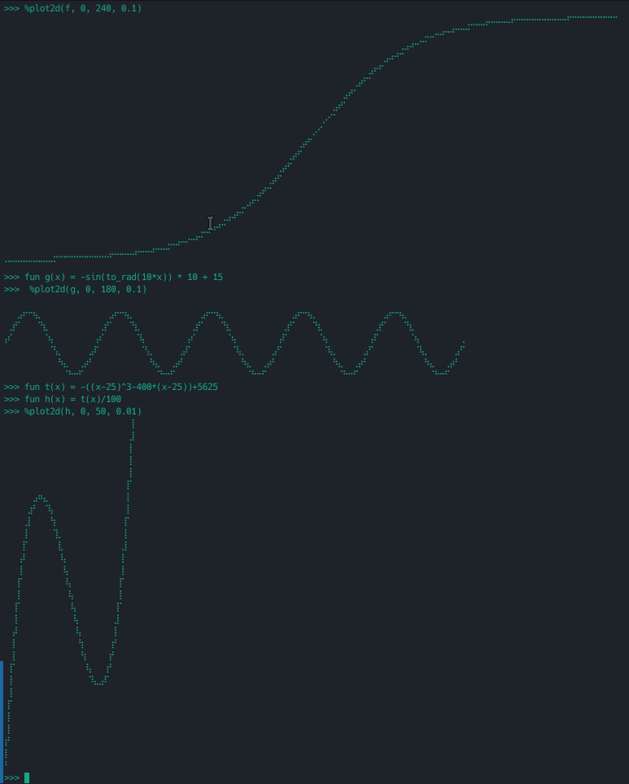

# 简易的计算器

一个简单的计算器，但是非常强大。

运算符支持: +-*/()!  
变量支持: 全局变量，只要在使用前声明即可  
函数支持: 无限层次的函数嵌套，延后声明，还有一些内置函数  
精度支持: 全部 64 位浮点数运算

```
>>> 12.34 * 45.67 + 6! / 2^4
608.5678
>>> fun f(a b) = a^x + sin(b) * floor(a*b+5)
>>> x = 4
>>> f(ln(PI) E)
5.003415549553682
>>>
```

还有一个特别的函数图像支持：

绘制它们的代码如下：
```
fun f(x) = -1/(1+E^(-0.05*x+6)) * 80 + 80
%plot2d(f, 0, 240, 0.1)

fun g(x) = -sin(to_rad(10*x)) * 10 + 15
%plot2d(g, 0, 180, 0.1)

fun t(x) = -((x-25)^3-400*(x-25))+5625
fun h(x) = t(x)/100
%plot2d(h, 0, 50, 0.01)
```


**note: 虽然我还有一大堆的想法（矩阵支持，多线程支持，推理系统...）。但作为一个简单的项目，我不能让它太复杂。之后可能会单独列为一个项目添加更多的特性**
**note: 作为一个简单的项目，我没有特意去优化性能。本身也不是用于大型运算，过分优化并不合适**
