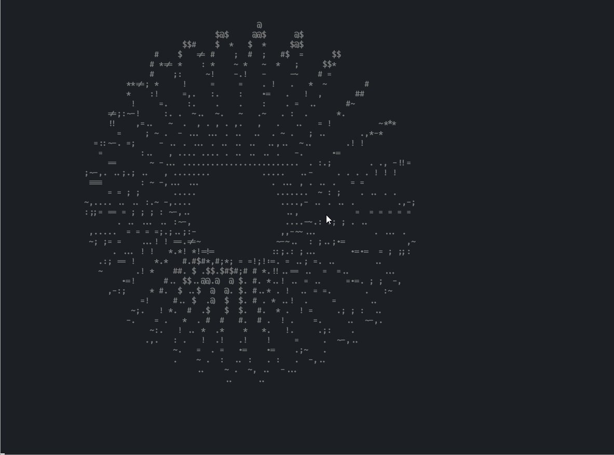

there is no other language implementation except Rust.

the neodonut is only implemented in Rust, because the calculate the donut need high performance.
maybe there will be a C++ implementation in the future.

## neodonut

there are two file -- `donut.rs` and `neodonut.rs`

### donut.rs

the `donut.rs` just a re-impl of [donut](https://www.a1k0n.net/2011/07/20/donut-math.html) in rust

but i use the "gray color" to enhance the sunlight.

and i also do a obfuscation:
```rust
                    use std::{ time,
               thread,f64};fn main(){let s
           =f64::consts::PI;let (w,h)= (60,26
        );let k= 30.0;let mut l=Vec::new();for i
      in 0..=11{let c=".,-~:;=!*#$@".chars().nth(i)
    .unwrap();let s=format!("\x1B[38;5;{}m{}",233+2*i
    ,c);l.push(s);} let(mut a,mut b)=(0.0_f64,0.0_f64);
   println!( "\x1B[2J");        loop {let((c,i),(j,q))=(a.
 sin_cos(),b.sin_cos(              ));let(mut o,mut m) = (
vec![" ";w*h],vec![                 0.0;w*h]);let mut p=0.0;
while p<2.0*s{let(n                  ,g)=p.sin_cos();let mut
t=0.0;while t<2.0*s                  {let(p,ct)=t.sin_cos();
let r=|xi,yi|{let(u,                 v)=(xi*c*n+yi*i,xi*g);
(u*q-v*j,u*j+v*q,yi*c              -xi*i*n)}; let(e,f)=(ct+
 2.0,p);let(x,y,z)=r(e,           f);let z=1.0/(z+5.0);let(
  x,y)=((30.0+k*z*x)as usize,(13.0-k/2.0*z*y)as usize);let
   k=r(ct,p);let n=8.0*(k.1-k.2);let g=w*y+x;if y<h &&x<w
    &&z>m[g]{m[g]=z ;o[ g]=l.get(n as usize).unwrap_or(
     &l[0]);}t +=s/128.0;}p+= s/128.0;}println!("\x1B\
      [H{}",o.chunks(w).map(|l|l.concat()).collect::<
        Vec<String>>().join("\n"));thread::sleep(
           time::Duration::from_millis(32))
                 ;a+=0.07;b+=0.03;}}
```

## neodonut.rs

this version, i made a lot of changes.

i make it with full colors and can automate re-render the suitable size when terminal changed.
And i also add a command line arg to change the number of samples.

there is some example:

no args:


with `--improve light`


with `--improve none --sample 20 15`


btw, there is a really experimental args `--threads <num>`.  
this arg indicate how many threads should be use, like 8 or 16.  
use 8 or 16 is really fast but it will use much cpu (on my laptop, it use 40% cpu R7-4800H) and the performance of terminal limit the fps
(even use the fastest terminal alacritty)

note: when the graph become very huge (e.g. height is above 300), render it will become really slow.
and pls use `cargo build --release`

on my laptop (R7 4800H) with alacritty (max scale) on Manjaro Linux:


btw, when i on same laptop on wsl2(ubuntu) with alacritty(windows version),
the fps is not fluent. and it occupied about 40% cpu.
but when i on manjaro linux, i run 3 in one time, they occupied about 45% cpu total and really fluent.
