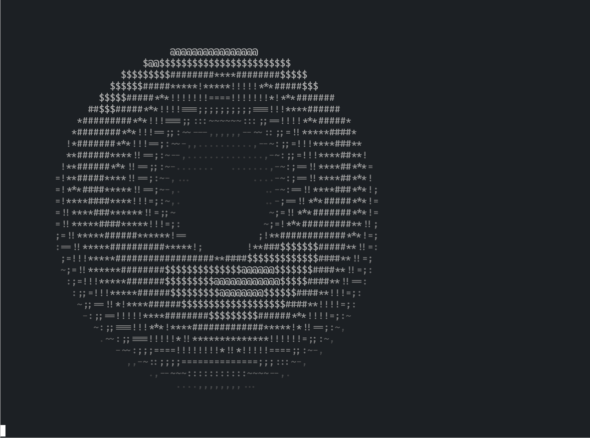
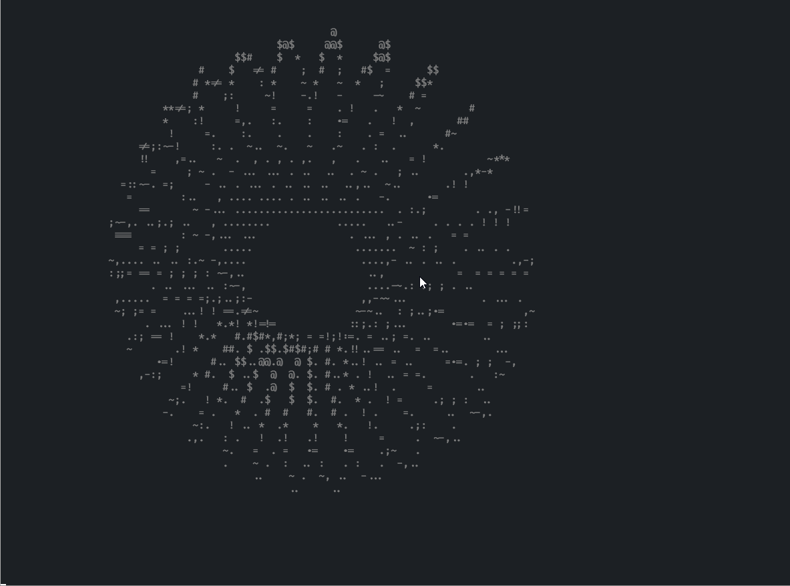

暂时只有 Rust 的代码实现，还没有其他语言的实现

## neodonut

Rust 的实现中主要包含 `donut.rs` 和 `neodonut.rs`。

### donut.rs

这只是原本的 [donut](https://www.a1k0n.net/2011/07/20/donut-math.html) 的复刻

使用了灰度值去增强 3D 效果

代码已经压缩到了甜甜圈的形状:
```rust
                    use std::{ time,
               thread,f64};fn main(){let s
           =f64::consts::PI;let (w,h)= (60,26
        );let k= 30.0;let mut l=Vec::new();for i
      in 0..=11{let c=".,-~:;=!*#$@".chars().nth(i)
    .unwrap();let s=format!("\x1B[38;5;{}m{}",233+2*i
    ,c);l.push(s);} let(mut a,mut b)=(0.0_f64,0.0_f64);
   println!( "\x1B[2J");        loop {let((c,i),(j,q))=(a.
 sin_cos(),b.sin_cos(              ));let(mut o,mut m) = (
vec![" ";w*h],vec![                 0.0;w*h]);let mut p=0.0;
while p<2.0*s{let(n                  ,g)=p.sin_cos();let mut
t=0.0;while t<2.0*s                  {let(p,ct)=t.sin_cos();
let r=|xi,yi|{let(u,                 v)=(xi*c*n+yi*i,xi*g);
(u*q-v*j,u*j+v*q,yi*c              -xi*i*n)}; let(e,f)=(ct+
 2.0,p);let(x,y,z)=r(e,           f);let z=1.0/(z+5.0);let(
  x,y)=((30.0+k*z*x)as usize,(13.0-k/2.0*z*y)as usize);let
   k=r(ct,p);let n=8.0*(k.1-k.2);let g=w*y+x;if y<h &&x<w
    &&z>m[g]{m[g]=z ;o[ g]=l.get(n as usize).unwrap_or(
     &l[0]);}t +=s/128.0;}p+= s/128.0;}println!("\x1B\
      [H{}",o.chunks(w).map(|l|l.concat()).collect::<
        Vec<String>>().join("\n"));thread::sleep(
           time::Duration::from_millis(32))
                 ;a+=0.07;b+=0.03;}}
```

## neodonut.rs

在这个版本中我添加了许多我个人的想法，颜色、采样值、缩放等等。

这儿有一些例子:

默认:


`--improve light`:


`--improve none --sample 20 15`


另外，neodonut 还支持多线程计算，使用 `--thread <num>`。  
该选项会取消掉渲染每一帧之间的时间间隔，在图像非常大时（超过 600*300）效果较好。

贴心提示：希望渲染甜甜圈更流畅请务必使用 release build!

在我的笔记本（R7 4800H）上的表现：

alacritty 最大缩放，并无卡顿

另外有趣的是，在 wsl2 上跑一个就卡顿了，占用 40% 左右的 cpu。
但是到了 manjaro 上，同样的配置跑了 3 个也不卡，占用 45% 左右的 cpu。
