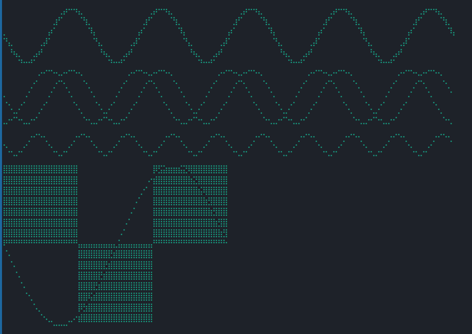
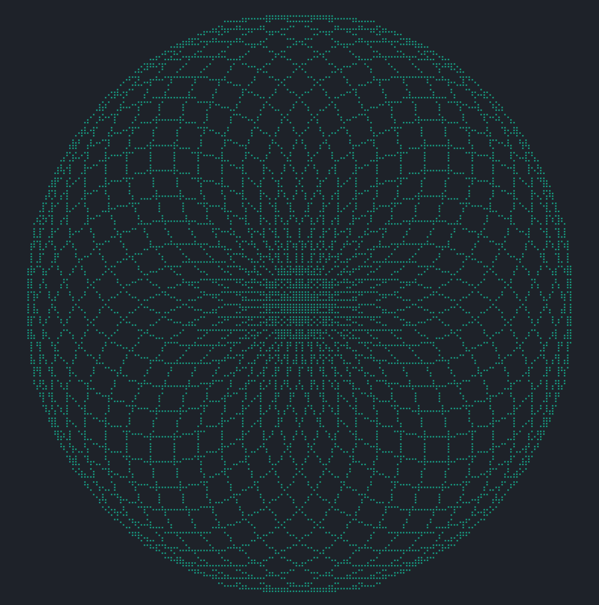
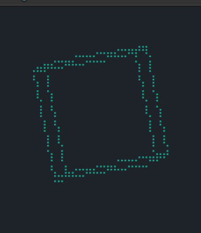

# drawille (Rust)

this is a copy version of [drawille](https://github.com/asciimoo/drawille),
i can't create a new meaningful name, so i use its original name.

## drawille-rust

this version is a little different from the origin.
you can find it in code, i think it is an improvement.

and there is a benchmark, just use `cargo bench` to see the result.
in my pc, it is 20 times faster than the origin.

in addition to `lib.rs` there are the following binary crate:

1. basic

2. turtle

3. cube

