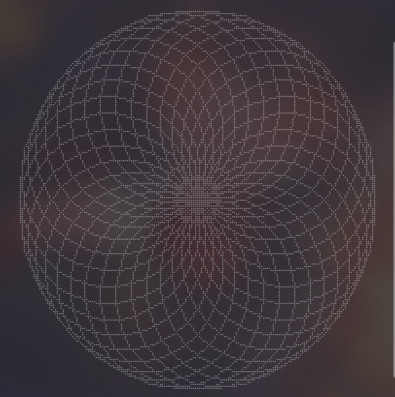
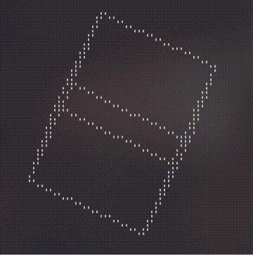

# drawille (Rust)

一个 [drawille](https://github.com/asciimoo/drawille) 的复刻版，我暂时不能想到一个有创意的名字就用原来的名字了。

## drawille-rust

这个版本和原来的版本有一些区别，在代码中可以看到，我个人认为是一种改进。

这个版本还包含一个性能测试，可以通过 `cargo bench` 来获取性能测试结果。
~~在我的笔记本上大约比原作者的快 20 倍，没有特别优化。~~  
现在我也不能确定有多快，我花费了一些时间，发现代码中最耗时的是使用 `x1B[2J` 清除屏幕所有内容，但这个控制符已经是我知道的最快的清除屏幕的方式了。
更有意思的是，在我使用的 windows terminal 上，这个终端控制符具有一定滞后才会真正擦除屏幕，期间甚至可以输出内容到屏幕，也就是说是异步的，这导致了大量的掉帧。
因此我在最近的更新中删除了尽可能减少 `Vec` 的方案，画布始终是矩形，使得不需要擦除屏幕而是使用新的输出覆盖旧的输出。这样虽然能完全避免掉帧但同时也会损失一部分性能。

除了 `lib.rs` 以外，还有如下二进制包:

1. basic

2. turtle

3. cube

